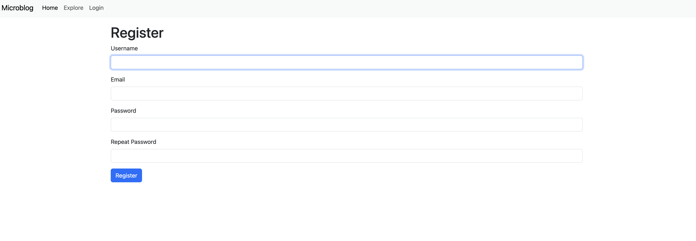
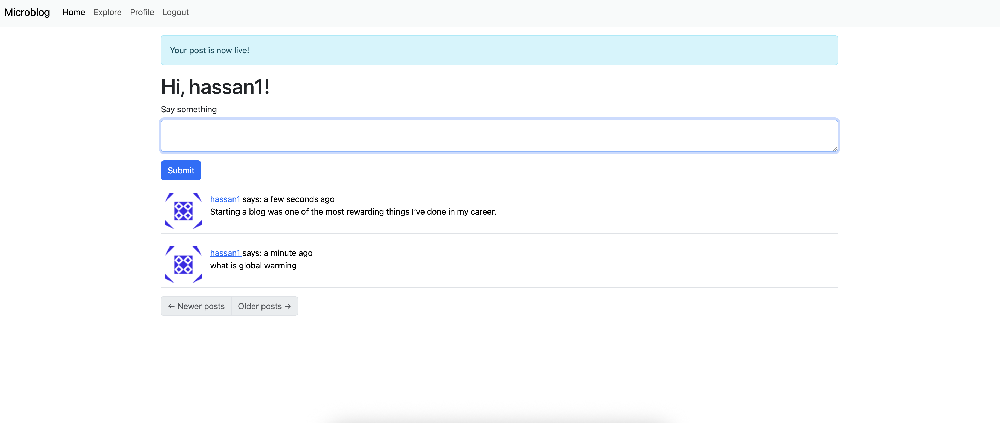
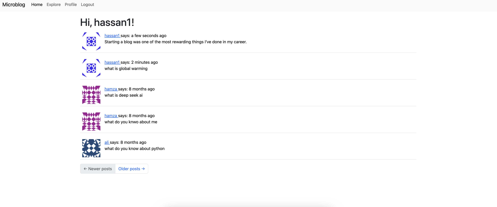
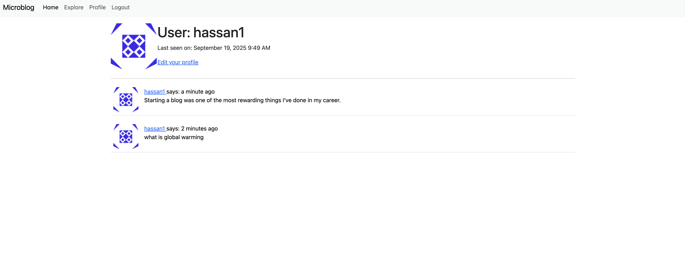
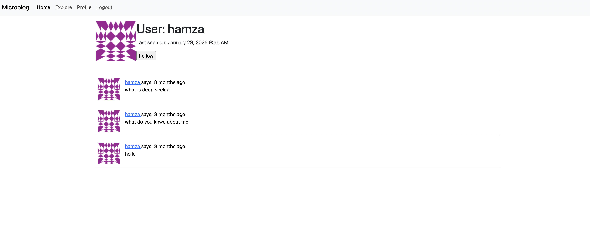

# Microblog

A full-featured microblogging web application built with Flask, similar to Twitter. This application allows users to create accounts, post updates, follow other users, and engage in a social networking experience.

## 📸 Screenshots

### User Registration


*New user registration form with validation*

### User Login


*User login form with "Remember Me" option*

### Home Page / Timeline


*User timeline with post creation form and recent posts*

### Explore Page


*Discover posts from all users on the platform*

### Explore Page


*Discover posts from all users on the platform*

### Profile Editing


*Edit profile information including username and about section*

## 🌟 Features

### Core Functionality

- **User Authentication & Authorization**

  - User registration with email validation
  - Secure login/logout with Flask-Login
  - Password reset via email
  - Remember me functionality
- **User Profiles**

  - Customizable user profiles with bio/about section
  - Gravatar integration for profile avatars
  - Profile editing capabilities
  - Last seen timestamp tracking
- **Microblogging**

  - Create, edit, and delete posts
  - Timeline view with posts from followed users
  - Pagination for post feeds
  - Timestamp display with Flask-Moment
- **Social Features**

  - Follow/unfollow other users
  - View followers and following lists
  - Personalized feed based on followed users
  - Explore page to discover new posts

## 🛠️ Technology Stack

- **Backend Framework**: Flask 3.1.0
- **Database**: SQLAlchemy with SQLite (development) / PostgreSQL (production ready)
- **Authentication**: Flask-Login
- **Forms**: Flask-WTF with WTForms
- **Email**: Flask-Mail
- **Database Migrations**: Flask-Migrate (Alembic)
- **Time Display**: Flask-Moment
- **Password Security**: Werkzeug security utilities
- **Token Generation**: PyJWT for password reset tokens

## 📋 Prerequisites

- Python 3.8 or higher
- pip (Python package manager)
- Git

## 🚀 Installation & Setup

### 1. Clone the Repository

```bash
git clone https://github.com/M-AliHamza/microblog.git
cd microblog
```

### 2. Create Virtual Environment

```bash
# On macOS/Linux
python3 -m venv venv
source venv/bin/activate

# On Windows
python -m venv venv
venv\Scripts\activate
```

### 3. Install Dependencies

```bash
pip install -r requirements.txt
```

### 4. Environment Configuration

The `.flaskenv` file is already configured with:

```bash
FLASK_APP=microblog.py
FLASK_ENV=development
FLASK_DEBUG=1
```

### 5. Initialize Database

```bash
# Create database migrations
flask db init

# Generate initial migration
flask db migrate -m "Initial migration"

# Apply migrations to create database tables

```

### 6. Run the Application

```bash
flask run
```

The application will be available at `http://127.0.0.1:5000/`

## 📁 Project Structure

```
microblog/
├── app/                      # Application package
│   ├── __init__.py          # App initialization and configuration
│   ├── routes.py            # URL routes and view functions
│   ├── models.py            # Database models (User, Post)
│   ├── forms.py             # WTForms form classes
│   ├── email.py             # Email utility functions
│   ├── errors.py            # Error handlers
│   ├── templates/           # HTML templates
│   │   ├── base.html        # Base template with navigation
│   │   ├── index.html       # Homepage
│   │   ├── login.html       # Login page
│   │   ├── register.html    # Registration page
│   │   ├── user.html        # User profile page
│   │   ├── edit_profile.html
│   │   ├── _post.html       # Post partial template
│   │   └── email/           # Email templates
│   └── static/              # Static files (CSS, JS, images)
├── migrations/              # Database migration files
├── logs/                    # Application logs (created at runtime)
├── tests.py                 # Unit tests
├── config.py                # Configuration settings
├── microblog.py            # Application entry point
├── requirements.txt         # Python dependencies
├── .flaskenv               # Flask environment variables
├── .gitignore              # Git ignore file
└── README.md               # This file
```

## 🔧 Configuration

The application uses a configuration class in `config.py` with the following settings:

- `SECRET_KEY`: Used for cryptographic operations
- `SQLALCHEMY_DATABASE_URI`: Database connection string
- `POSTS_PER_PAGE`: Number of posts per page (default: 5)
- `MAIL_SERVER`, `MAIL_PORT`, `MAIL_USE_TLS`: Email server configuration
- `ADMINS`: List of admin email addresses for error notifications

## 🧪 Testing

Run the test suite:

```bash
python tests.py
```

## 💻 Development

### Running Flask Shell

To interact with the application in a Python shell:

```bash
flask shell
```

This provides access to:

- `db`: Database instance
- `User`: User model
- `Post`: Post model
- `sa`: SQLAlchemy
- `so`: SQLAlchemy ORM

### Database Migrations

When you make changes to database models:

```bash
# Generate a new migration
flask db migrate -m "Description of changes"

# Apply the migration
flask db upgrade

# Rollback if needed
flask db downgrade
```

### Creating a Test User

In Flask shell:

```python
u = User(username='testuser', email='test@example.com')
u.set_password('password123')
db.session.add(u)
db.session.commit()
```

## 🐛 Debugging

- Development mode includes debug toolbar
- Logs are stored in `logs/microblog.log` in production
- Check browser console for client-side errors

## 📝 API Endpoints

Main routes available:

- `/` - Homepage with post feed
- `/login` - User login
- `/logout` - User logout
- `/register` - New user registration
- `/user/<username>` - User profile page
- `/edit_profile` - Edit profile
- `/follow/<username>` - Follow a user
- `/unfollow/<username>` - Unfollow a user
- `/explore` - Discover new posts
- `/reset_password_request` - Request password reset
- `/reset_password/<token>` - Reset password with token

## 🚢 Deployment

For production deployment:

1. Set `FLASK_ENV=production`
2. Use a production WSGI server (e.g., Gunicorn)
3. Set up a production database (PostgreSQL recommended)
4. Configure a reverse proxy (e.g., Nginx)
5. Set up SSL certificates
6. Configure email service for notifications

Example with Gunicorn:

```bash
pip install gunicorn
gunicorn -w 4 -b 0.0.0.0:8000 microblog:app
```

## Acknowledgments

- Flask documentation and community
- Miguel Grinberg's Flask Mega-Tutorial
- Bootstrap for UI components
- Gravatar for user avatars
